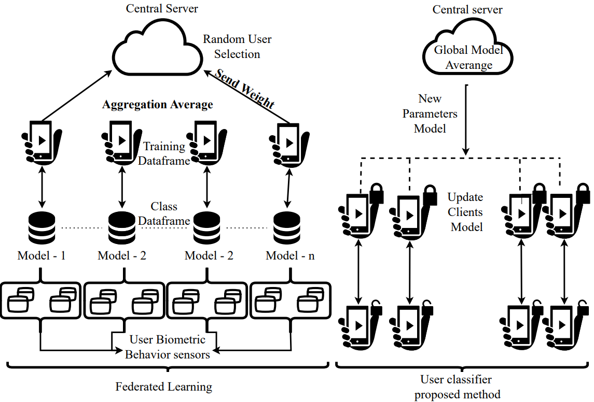

# A Federated Learning Approach for Continuous User Identification

# Authors
- Rafael Veiga 
- Rodrigo Flexa
- Lucas Bastos
- Iago Medeiros
- Denis Rosário
- Eduardo Cerqueira

# Abstract

Smartphones will remain key devices in the 6G era, where many applications and services will collect and share a lot of sensitive data. Smartphones can collect biometric behaviors from users during the use of devices, and the data will be analyzed and processed by machine learning approaches, where privacy and security issues are mandatory in 6G systems. However, an identification system using a mobile device does not need to share sensitive data, focusing on data security and sharing just user weights. In this paper, we propose a Federated Learning (FL) approach based on accelerometer and gyroscope data to identify a user's behavior for continuous user identification. This study evaluates the performance of accuracy, Loss, False Rejection Rate (FRR), weights and runtime processing of different Convolutional Neural Networks (CNN) for continuous user identification. The simulation results show that the best configuration is when using FCN with 4 and 3 epochs.

# Big picture

# federated_run.py

The python file is for running our simulation federated learning. In this, we choose some Convolutional neural networks to evaluate and the metrics we search to identify users like the False positive rate and rejection rate. Thus, we made a code to run federated learning in his main strategy FedAVG. We use some CNNs from Sktime-dl to run users using gyroscope sensors as unique identifiers.

# analysis_final.ipynb

In this Jupyter project, we do a complete analysis of BrainRun to understand how they collect and distribute this data. The times to span each sample and how this influences the data frame. The code shows the many groups created from the number of timestamps. With this, we prepare the minimum values we need to prepare the data frame we will use for Federated Learning. 

